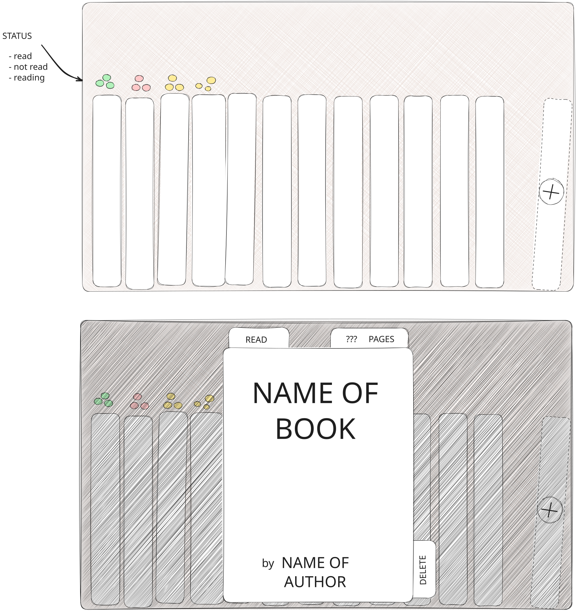

# Odin library

This is the first project of the JavaScript Course from the curriculum of [The Odin Project](https://www.theodinproject.com/lessons/node-path-javascript-library).

It consists of a small library app that serves to cement the knowledge acquired in the previous lessons; prominently, Javascript objects and constructors, and HTML forms.

## Initial design

The app will consist on a screen filled with books. The books will display their titles (and maybe authors) on the spines and the read status via some floating circles that resemble fireflies. At the right, a semi-transparent / semi-outlined book with a plus sign will serve to add books to the library.

When the user clicks on a book, a dialog will open, where they will be able to change the info about the book and delete it.

